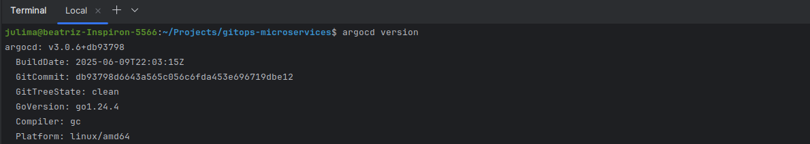
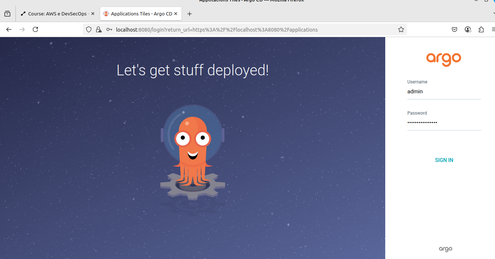
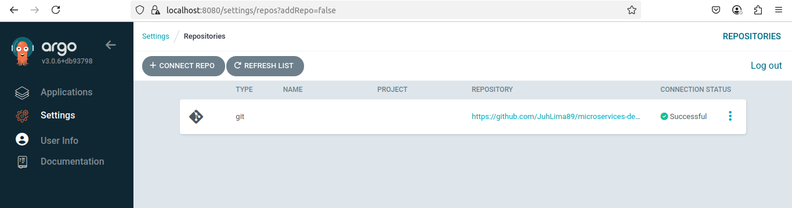
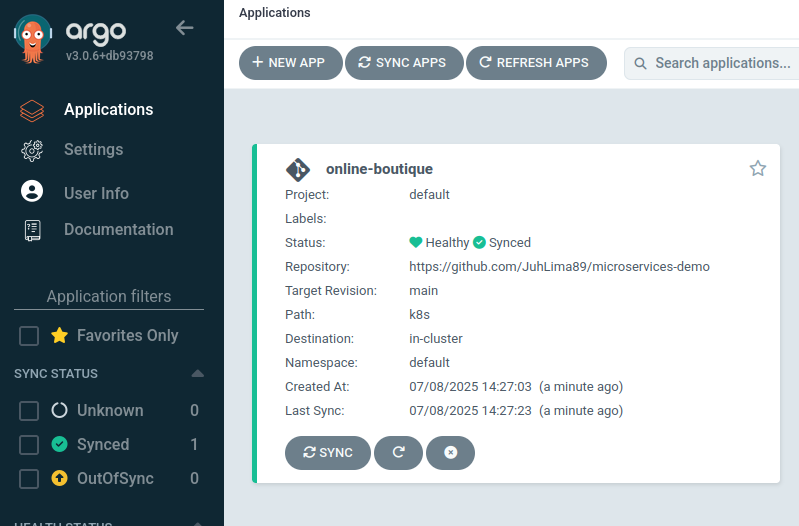
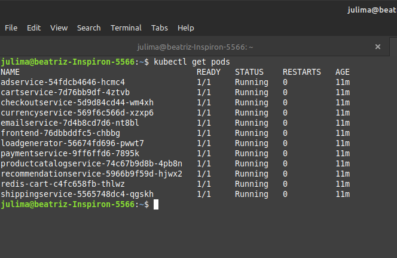
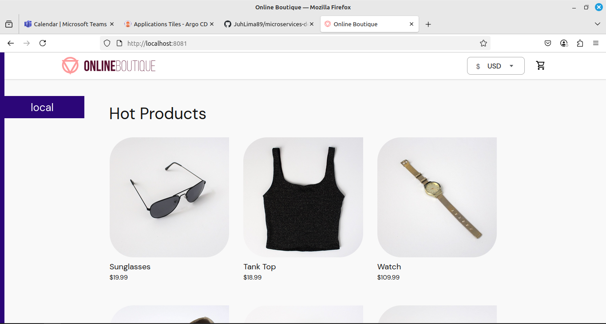
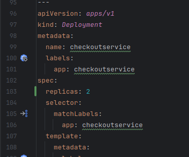

# 🛍️ Online Boutique com GitOps e Kubernetes

Este projeto tem como objetivo executar **um conjunto de microserviços** (Online Boutique) em **Kubernetes** local usando **Rancher Desktop**, controlado por **GitOps com ArgoCD**, a partir de um repositório público no GitHub.

---

## 🚀 Objetivo

> Automatizar a implantação de microserviços no Kubernetes local, utilizando ArgoCD para GitOps, com base em um repositório Git versionado.

---

## 📋 Pré-requisitos

Antes de começar, certifique-se de que você tem:

- ✅ Rancher Desktop instalado com Kubernetes habilitado;
- ✅ `kubectl` configurado corretamente (`kubectl get nodes` deve funcionar);
- ✅ ArgoCD instalado no cluster Kubernetes;
- ✅ Conta no GitHub com um repositório público;
- ✅ Git instalado;
- ✅ Docker funcionando localmente.

---

## 🛠️ Etapas do Projeto

### 1. 📁 Fork e criação do repositório

1. Faça o **fork** do repositório oficial da aplicação:
   - https://github.com/GoogleCloudPlatform/microservices-demo

2. Crie um novo repositório no GitHub com a seguinte estrutura:

```
gitops-microservices/
└── k8s/
    └── online-boutique.yaml
```

> Utilize o arquivo `release/kubernetes-manifests.yaml` do repositório original e renomeie para `online-boutique.yaml`.

[📄 online-boutique.yaml](k8s/online-boutique.yaml)

---

### 2. 📦 Instalação do ArgoCD no cluster local

Execute os seguintes comandos:

```bash
kubectl create namespace argocd

kubectl apply -n argocd -f https://raw.githubusercontent.com/argoproj/argo-cd/stable/manifests/install.yaml
```



---

### 3. 🌐 Acessar o ArgoCD

Use o `port-forward` para acessar a interface web do ArgoCD:

```bash
kubectl port-forward svc/argocd-server -n argocd 8080:443
```

Acesse: [https://localhost:8080](https://localhost:8080)

- **Usuário:** `admin`
- **Senha:** (use o comando abaixo para descobrir)

```bash
kubectl -n argocd get secret argocd-initial-admin-secret   -o jsonpath="{.data.password}" | base64 -d && echo
```



---

### 4. 📂 Criar a Aplicação no ArgoCD

Nesta etapa, será criada uma aplicação dentro do ArgoCD que irá gerenciar o estado desejado do cluster Kubernetes com base nos manifests versionados em um repositório Git.

#### ✅ Passo 4.1: Conectar o ArgoCD ao Repositório Git

1. Acesse a interface web do ArgoCD (por padrão, disponível em http://localhost:8080 após o port-forward).
2. Faça login com o usuário e senha padrão (`admin` e a senha inicial do pod `argocd-server`, ou a senha já redefinida).
3. No menu lateral, clique em **Settings** > **Repositories**.
4. Clique em **Connect Repo**.
5. Preencha os campos:
   - **Type**: Git
   - **URL**: https://github.com/<seu-usuario>/<seu-repositorio>.git
   - Se o repositório for privado, adicione as credenciais de acesso (SSH ou HTTPS com token/personal access token).



#### ✅ Passo 4.2: Criar uma Nova Aplicação no ArgoCD

1. No dashboard do ArgoCD, clique em **+ NEW APP**.
2. Preencha os campos conforme abaixo:
   - **Application Name**: online-boutique
   - **Project**: default
   - **Sync Policy**: Manual (ou automática, se preferir)
   - **Repository URL**: https://github.com/<seu-usuario>/<seu-repositorio>.git
   - **Revision**: main (ou a branch que deseja utilizar)
   - **Path**: k8s (diretório onde está o `online-boutique.yaml`)
   - **Cluster**: https://kubernetes.default.svc (default para clusters locais)
   - **Namespace**: default (ou outro namespace, se preferir)

#### ✅ Passo 4.3: Sincronizar a Aplicação

1. Após criar a aplicação, ela aparecerá no painel principal.
2. Clique na aplicação `online-boutique`.
3. Clique em **SYNC** > **SYNCHRONIZE** para aplicar os recursos no cluster.
4. O ArgoCD irá comparar o estado atual do cluster com os manifests e aplicar as alterações necessárias.




---


### 5. 🖥️ Acessar o Frontend da Boutique

O serviço frontend é do tipo `ClusterIP`, então é necessário fazer um port-forward:

```bash
kubectl port-forward svc/frontend 8081:80
```

Acesse a aplicação em: [http://localhost:8081](http://localhost:8081)



---

## Opcional:

- Adicionei 2 réplicas a um deployment do projeto



## ✅ Entregas Esperadas

- [x] Repositório Git público com os manifests YAML organizados;
- [x] ArgoCD instalado e funcional no cluster;
- [x] Aplicação criada no ArgoCD e sincronizada;
- [x] Pods da aplicação rodando corretamente;
- [x] Acesso funcional ao frontend via `kubectl port-forward`;
- [x] (Opcional) Customizar o manifest (ex: mudar número de réplicas de
algum microserviço)

---

## 🧪 Extras e Dicas

- Para monitorar os pods:
  ```bash
  kubectl get pods
  ```
- Para visualizar logs:
  ```bash
  kubectl logs <nome-do-pod>
  ```

---

## 📎 Referências

- [Online Boutique (GoogleCloudPlatform)](https://github.com/GoogleCloudPlatform/microservices-demo)
- [ArgoCD - Getting Started](https://argo-cd.readthedocs.io/en/stable/getting_started/)
- [Kubernetes Docs](https://kubernetes.io/pt/docs/)

---

## 💡 Autor(a)

**Juliana Lima**  
🔗 [github.com/JuhLima89](https://github.com/JuhLima89)
